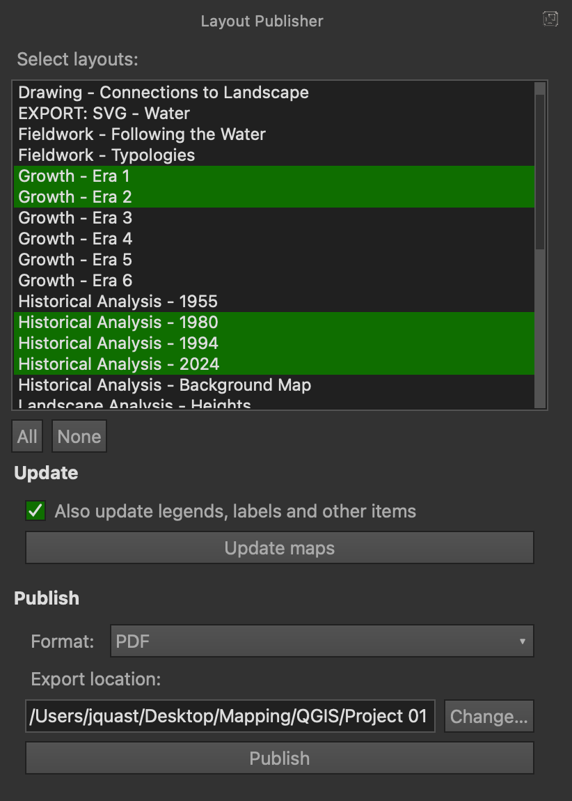
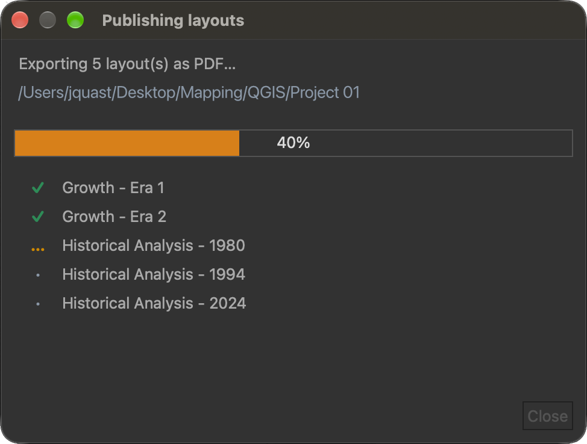

# layout_publisher
QGIS plugin that lets the user refresh and publish multiple print layouts at once.

Instead of opening each print layout, refreshing its maps and exporting it by
hand, Layout Publisher adds a dockable panel to the QGIS main window. It lists
all print layouts of the current project. You pick the ones you want, then
refresh their maps or export them as PDF or PNG into a folder of your choice.


</br>


## Features

- Dockable panel listing all print layouts of the current project, kept in sync
  when layouts are added, renamed or removed, or another project is opened
- Multi-selection, plus **All** / **None** buttons
- **Update:** refresh every map item in the selected layouts, optionally the
  rest of each layout too (legends, labels, scale bars, ...)
- **Publish:** export the selected layouts as **PDF** or **PNG**
- A default **export location** that is remembered between sessions
- A progress window while publishing, with a green check next to every
  layout that was exported and a red cross (with the error as tooltip) for any
  that failed
- A clear error ("Please set an export location.") if you try to publish
  before choosing a folder

## Requirements

- QGIS 3.30 or newer
- No additional Python packages

## Installation

**From the QGIS Plugin Manager**:

1. In QGIS, open **Plugins → Manage and Install Plugins…**
2. Search for **Layout Publisher** and click **Install Plugin**.

**From a ZIP file:**

1. Download the repository as a ZIP file from GitHub or from
   https://plugins.qgis.org/plugins/layout_publisher/. The ZIP must contain a
   single top-level folder named `layout_publisher`.
2. In QGIS, open **Plugins → Manage and Install Plugins… → Install from ZIP**
   and select the file.

To manually zip the plugin folder on macOS, don't create the ZIP with Finder's
"Compress" command. It adds a `__MACOSX` folder that QGIS tries to load as a plugin.
Create it from the terminal instead:

```bash
zip -r layout_publisher.zip layout_publisher -x "*.DS_Store" -x "__MACOSX/*"
```

or, if you cloned the git repository:

```bash
git archive --prefix=layout_publisher/ -o layout_publisher.zip HEAD
```

## Usage

1. Open the panel with the Layout Publisher button in the toolbar, or via
   **Plugins → Layout Publisher**. Use the same button to hide it again.
2. Select one or more layouts in the list (Ctrl/Cmd-click or Shift-click, or
   use **All**).

### Updating maps

3. Optionally tick **Also update legends, labels and other items** to refresh
   the whole layout and not only its map items.
4. Click **Update maps**. A summary appears below the panel, for example
   *"Updated 6 map(s) in 3 layout(s)."*

"Update" re-renders the maps with the current state of the project, for
example after you changed layer styles or data. It does **not** change a map's
extent, scale or layer set.

### Publishing layouts

3. Choose the export format, **PDF** or **PNG**.
4. Click **Set…** and choose the folder to export to. The button changes to
   **Change…** once a folder is set. The folder and format are remembered.
5. Click **Publish**. A progress window opens and shows each layout as it is
   exported. When it says *Done*, click **Close**.

Files are named after the layout, for example `Site plan.pdf`. Characters that
aren't allowed in file names (`\ / : * ? " < > |`) are replaced with `_`.

## Known limitations

This is a first release, and it does only what is listed above. Please be
aware of the following:

- **Atlas layouts** are exported like normal layouts, as a single file. There
  is no export of one file per atlas page.
- **Export settings can't be changed.** Layouts are exported with QGIS's
  default PDF and image export settings, so resolution follows each layout's
  own export resolution. There are no options for DPI, compression, metadata
  or other settings in the panel.
- **Only PDF and PNG** are supported (no SVG, JPEG, TIFF, ...).
- **Existing files are overwritten** without asking if a file with the same
  name is already in the export folder.
- **File name collisions:** because special characters are replaced with `_`,
  two layouts such as `A/B` and `A:B` would both become `A_B` and the second
  would overwrite the first.
- **Multi-page layouts** exported as PNG may produce one image per page, with
  the file naming for additional pages decided by QGIS. This hasn't been
  tested thoroughly.
- **No cancel button.** Each layout is exported on QGIS's main thread, so QGIS
  can briefly seem unresponsive while a large layout is rendered. The progress
  window only updates between layouts, and it can't be closed until the
  export has finished.
- **"Update" only refreshes.** It doesn't sync map extents with the main map
  canvas, and it doesn't change map scale, layers or themes.
- **Print layouts only.** QGIS *reports* are not supported. If your project
  contains reports they may appear in the list and will give an error when
  used.
- **One export location for all projects.** The folder and format are stored
  in your QGIS profile, not in the project.
- **Exports aren't verified.** A layout is shown as successful when QGIS
  reports success. The plugin does not inspect the written file.
- **Limited testing.** The plugin was developed and tested on macOS. It hasn't
  been tested on Windows or Linux, or on QGIS 4 (Qt6), so Qt6 support is not
  declared yet.
- The interface is in **English only**.

## Possible future features

These are ideas, not promises, and they are in no particular order:

- Export atlas layouts, one file per atlas page
- Combine all exported PDFs into one file
- Settings for export resolution (DPI) and other PDF/PNG options
- More formats, such as SVG
- Ask before overwriting, or choose a file name pattern (for example with a
  date or the project name)
- A cancel button, and keeping the interface responsive while exporting
- Store the export location per project
- Set up a folder structure for exported layouts
- Support for QGIS reports
- Qt6 / QGIS 4 compatibility and testing on Windows and Linux
- i18n Translations

Suggestions are welcome. Open an issue and describe how you'd use it.

## Reporting problems and contributing

Bug reports and feature requests go to the
[issue tracker](https://github.com/jo-quast/layout_publisher/issues). When
reporting a bug, please include your QGIS version, your operating system and
any error text shown in the panel or in the Python console
(**Plugins → Python Console**) or the **Log Messages** panel.

Pull requests are welcome. Please keep the code PEP 8 compliant (maximum line
length 100) and add docstrings for new classes and methods.

## Development

This plugin was developed with the help of Claude, an AI assistant by
Anthropic, which generated much of the initial code and documentation. I
engineered, reviewed, tested and adapted the result and am responsible for
the plugin and its maintenance.

## License

Layout Publisher is free software, released under the
[GNU General Public License, version 3](LICENSE).

## Author

Jonathan Quast